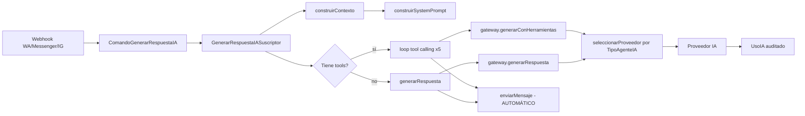
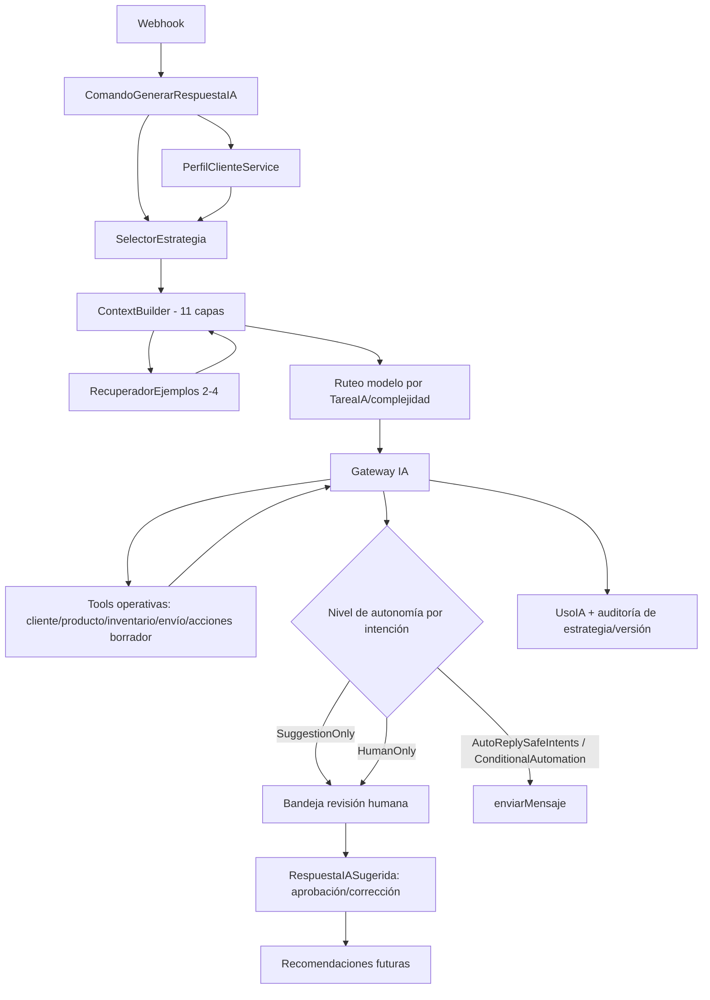

# Evolución del agente de IA — Análisis y plan

> Estado: las 10 specs (`009`-`018`) están especificadas y planificadas (`specs/009-*` a `specs/018-*`). Progreso de implementación:
> - ✅ `009-perfil-agente-estructurado-versionado` — implementada (2026-09-01). Pendiente: test Playwright del flujo de versionado, visualización de versión en estadísticas de uso, advertencia de cambios sin guardar (ver `specs/009-.../tasks.md`, sección "Resumen de estado").
> - ✅ `010-enrutamiento-modelos-ia-por-objetivo` — implementada (2026-09-01). Pendiente: panel de detalle de uso de IA por objetivo/proveedor (ver `specs/010-.../tasks.md`, sección "Resumen de estado").
> - ✅ `012-perfil-dinamico-cliente` — implementada (2026-09-01), fuera de orden numérico (antes que `011`, que no tenía dependencias bloqueantes reales). Creó `src/ai/estrategia/tipos.ts` por adelantado para que `011` lo reutilice. Pendiente: validación manual con RabbitMQ corriendo (ver `specs/012-.../tasks.md`).
> - ✅ `011-playbook-estrategia-comercial` — implementada (2026-09-01).
> - ✅ `013-context-builder-capas-precedencia` — implementada (2026-09-01). Conecta `009`+`011`+`012` al prompt real por primera vez, con retrocompatibilidad verificada por test (no solo inspección) y precedencia de reglas obligatorias sobre estrategia/perfil verificada explícitamente. Corrigió un bug de build real arrastrado de `011` (ver `specs/013-.../tasks.md`).
> - ⏳ `014` a `018` — especificadas, sin implementar todavía.

## 1. Resumen ejecutivo

Karia ya tiene una capa de IA no trivial: proveedores múltiples con failover, tool calling con Anthropic, auditoría de costos/tokens, construcción de contexto con presupuesto de tokens, y un formulario de configuración por campos estructurados (no un textarea de prompt libre). Esto cambia el punto de partida respecto al pedido original: **no hay que crear un sistema configurable desde cero, hay que extender uno que ya sigue buena parte del espíritu pedido** (config estructurada → prompt generado, no prompt monolítico).

Lo que falta es todo lo que convierte esa base en "inteligencia del cliente + estrategia comercial no invasiva + aprendizaje supervisado": perfil dinámico del cliente, playbooks de venta, conversaciones piloto, recuperación de ejemplos, niveles de autonomía, versionado y simulador. Ninguno de estos conceptos existe hoy ni como tabla ni como servicio.

También hay dos hallazgos de riesgo que **contradicen directamente** requisitos del pedido y deben resolverse como parte del plan, no ignorarse:

- El agente **ya envía mensajes automáticamente** sin ningún nivel de autonomía ([generar-respuesta-ia.suscriptor.ts](../src/suscriptores/ai/generar-respuesta-ia.suscriptor.ts)) — hoy no existe "SuggestionOnly" como default.
- Las tools `crear_cotizacion` y `crear_pedido` **crean el registro real directamente**, no un borrador — violan "no permitir acciones irreversibles sin autorización" tal como están hoy.

Estos dos puntos son intencionales en el sistema actual (así fue construido en specs anteriores) y cambiarlos es un cambio de comportamiento visible para el negocio, no un detalle técnico — se marca como decisión pendiente en la sección 14.

---

## 2. Configuración actual

### 2.1 Funcionalidades existentes

- Config de IA por instancia (`ConfiguracionIA`, 1:1 con `Instancia`): habilitar/deshabilitar, proveedor y modelo default, temperatura default, límites de tokens diarios/mensuales, fallback.
- Múltiples `ProveedorIA` por instancia (Anthropic, OpenAI, Gemini, DeepSeek, NVIDIA, Local), cada uno con API key, modelos disponibles, prioridad, rate limits, costo por 1K tokens, timeout/reintentos, y **scope opcional por `TipoAgenteIA`** (`COMERCIAL` | `GERENCIA`).
- Selección de proveedor con **circuit breaker en memoria** (3 fallas → bloqueo 5 min) y fallback por prioridad ([orquestador.ts](../src/ai/orquestador/orquestador.ts)).
- `AgenteIAConfig`: extensión 1:1 de un `Usuario` (tipo `AGENTE`) con objetivo, personalidad, especialidad, tono estructurado (`configuracionTono` JSON: tono/formalidad/emojis/tuteo/humor/nombre), temperatura override, modelo preferido, lista de herramientas habilitadas, canales permitidos, memoria habilitada, límite de tokens de contexto, instrucciones adicionales (lista), y un `sistemaPrompt` de override libre (append-only, no reemplaza lo generado).
- **El prompt final se genera desde estos campos estructurados**, no se escribe a mano ([builder.ts](../src/ai/prompt/builder.ts)): rol → tono → especialidad → restricciones fijas (tenant isolation, idioma del cliente, concisión) → instrucciones adicionales → contexto dinámico (contacto/oportunidad) → override libre → bloque anti prompt-injection fijo al final.
- Tool calling real con Anthropic (`chatConHerramientas`), loop de hasta 5 iteraciones, 6 tools registradas: `obtener_info_cliente`, `buscar_productos`, `actualizar_info_contacto`, `agregar_etiqueta_contacto`, `crear_cotizacion`, `crear_pedido`, `transferir_a_humano`.
- Cada tool valida `instanciaId` desde el contexto del servidor (nunca del LLM) — aislamiento multi-tenant ya correcto a nivel de tool.
- Auditoría de uso: tabla `UsoIA` (tokens in/out, costo estimado, éxito/error, tiempo, entidad relacionada) por cada llamada al proveedor, incluida cada iteración de tool calling.
- Enum `TareaIA` ya modela distintos objetivos de invocación: `CHAT, RESUMEN, CLASIFICACION, SENTIMIENTO, EXTRACCION_ENTIDADES, REPORTE, EMBEDDINGS`.
- Router de contexto (`resolverDecisionContexto`) calcula cuántos mensajes incluir según presupuesto de tokens; tiene un placeholder para "usar resumen" cuando exista (aún no implementado).
- Permiso dedicado `"ia"` en `verificarAcceso` (multi-tenant + roles).

### 2.2 Entidades y campos actuales (schema.prisma)

`ConfiguracionIA`, `ProveedorIA`, `AgenteIAConfig`, `MemoriaAgenteIA` (episódico/semántico/procedural, con expiración — **definida pero no usada en ningún flujo**, greppeado sin resultados fuera de Prisma generado), `UsoIA`. Enums: `ProveedorIAEnum`, `TareaIA`, `TipoMemoriaIA`, `TipoAgenteIA`.

El campo `ProveedorIA.casosDeUso` (`Json?`) **existe en el schema pero no se lee ni se escribe en ningún lado del código de aplicación** — es el punto de extensión obvio para "qué IA usar según objetivo" y hoy está muerto.

### 2.3 Flujo actual de generación de respuesta

```
Evento entrante (webhook WA/Messenger/Instagram)
  → ComandoGenerarRespuestaIA (cola RabbitMQ)
    → GenerarRespuestaIASuscriptor
        1. resuelve agenteIAConfig (payload o default COMERCIAL de la instancia)
        2. construirContexto() → arma system prompt (builder.ts) + últimos N mensajes
        3. si el agente tiene herramientas habilitadas → generarConHerramientas() en loop (máx 5 iteraciones)
           si no → generarRespuesta() directo
        4. dentro del gateway: seleccionarProveedor(instanciaId, agente.tipo) → llama al proveedor → registra UsoIA
        5. enviarMensaje() — ENVÍA AL CLIENTE SIN REVISIÓN HUMANA
```

También existe `generarSugerenciaIA` (server action) para el flujo manual desde el panel de conversación, donde un humano pide una sugerencia y decide enviarla — ese sí es "SuggestionOnly" de facto, pero **coexiste** con el envío automático del suscriptor; no hay una única política de autonomía.

### 2.4 Componentes reutilizables

- `src/ai/gateway/` (gateway + tipos) — abstracción independiente de proveedor, ya lista para que capas superiores no conozcan el proveedor concreto.
- `src/ai/proveedores/` — patrón de registro (`registro.ts`) para agregar proveedores nuevos sin tocar el orquestador.
- `src/ai/tools/` — patrón `IProveedorTool` + registry + executor con validación de permisos por lista blanca (`herramientasPermitidas`), reutilizable tal cual para nuevas tools operativas.
- `src/ai/contexto/` — separación constructor/router/tipos, ya pensada para capas (aunque hoy solo tiene 3: system prompt, contacto, oportunidad).
- `src/configuracion/components/form-configuracion-ia.tsx` y `form-proveedor-ia.tsx` — formularios existentes en la tab "Inteligencia Artificial" de `/configuracion`, reutilizables como base de layout para las nuevas secciones.

### 2.5 Limitaciones encontradas

1. **Autonomía inexistente**: el suscriptor de cola envía siempre, sin niveles ni distinción por intención.
2. **Acciones irreversibles sin confirmación**: `crear_cotizacion`/`crear_pedido` crean registros reales, no borradores.
3. **Sin perfil de cliente**: el contexto solo trae nombre/empresa/oportunidad activa; no hay tipo de relación, intención comercial, historial de compras, ni señales objetivas.
4. **Sin playbooks**: cero soporte para estrategias de venta configurables/plantillas.
5. **Sin conversaciones piloto ni recuperación de ejemplos**: no existe el concepto de few-shot ni aprendizaje a partir de conversaciones reales.
6. **Sin versionado**: `AgenteIAConfig` es upsert directo (1 fila por usuario-agente); no hay borrador/publicado/historial/restore.
7. **Sin simulador**: no hay pantalla de prueba aislada de efectos reales.
8. **`casosDeUso` muerto**: no hay ruteo de modelo por tipo de tarea (económico vs. superior), solo por `TipoAgenteIA` (COMERCIAL/GERENCIA), que es un concepto distinto (rol del agente, no complejidad de la tarea).
9. **`AgenteIAConfig` atado 1:1 a un `Usuario`**: el "agente IA" hoy es una extensión de una cuenta de usuario tipo `AGENTE`, no una entidad de negocio independiente. Es compatible con "un agente por negocio" pero limita "varios agentes/personas sin cuenta de usuario asociada" si eso llegara a pedirse.
10. **Cero tests** para todo `src/ai/` y `src/configuracion/ia/` (`find` no encontró ningún `*.test.ts` en esas carpetas).

---

## 3. Configuración objetivo

### 3.1 Funcionalidades faltantes (vs. las 17 secciones del pedido)

Perfil dinámico del cliente, playbooks de estrategia, conversaciones piloto + análisis, recuperación de ejemplos relevantes, herramientas de inventario/envíos/promociones, acciones comerciales en modo borrador, context builder por capas con precedencia explícita, selector de estrategia auditable, niveles de autonomía por intención, registro de aprendizaje supervisado, versionado de configuración, simulador, y reorganización de la UI en 10 secciones. Además: enrutamiento de modelo IA por objetivo/tarea (pedido explícito al final del mensaje del usuario).

### 3.2 Elementos que pueden extenderse (sin romper nada)

- `AgenteIAConfig` → agregar campos estructurados nuevos (longitud de respuesta, nivel de proactividad, intensidad comercial, estilo de recomendación, frases preferidas/prohibidas, comportamientos prohibidos, idioma principal/permitidos, condición de transferencia) como columnas/JSON nuevas, todas opcionales con default = comportamiento actual.
- `construirSystemPrompt` → refactor interno a "capas" sin cambiar su firma pública inmediatamente (permite migrar consumidores en fases).
- `ProveedorIA.casosDeUso` → activarlo (ya existe en BD) para mapear `TareaIA` → proveedor preferido.
- `ToolRegistry`/`IProveedorTool` → patrón ya listo para sumar tools de inventario/envío sin tocar las existentes.
- Tab "Inteligencia Artificial" de `/configuracion` → convertirla en sub-navegación de secciones en vez de un solo formulario largo.

### 3.3 Elementos que deberían desacoplarse

- **Playbook/estrategia** debe ser su propia entidad, no un campo de `AgenteIAConfig` — se activa/asigna, no se hardcodea en el agente.
- **Perfil del cliente** debe ser un servicio de lectura (deriva de datos reales: `Contacto`, `Oportunidad`, `Pedido`, `Cotizacion`, `Conversacion`) separado de cualquier interpretación de IA — el pedido es explícito en no mezclar objetivo con subjetivo.
- **Selección de proveedor por tarea** debe desacoplarse de "tipo de agente" (`COMERCIAL`/`GERENCIA`); son dos ejes distintos y hoy están mezclados en una sola función (`seleccionarProveedor`).
- **Ejecución de acciones comerciales** (crear cotización/pedido) debe desacoplarse de "creación directa" → pasar por un estado borrador que respete el nivel de autonomía configurado.

### 3.4 Cambios de modelo de datos (alto nivel — detalle en cada spec)

Nuevas tablas (todas con `instanciaId` + índices de aislamiento, siguiendo el patrón ya usado en todo el schema):

- `AgenteIAConfigVersion` (versionado: borrador/publicado/historial, referencia a qué versión generó cada `UsoIA`).
- `PlaybookEstrategia` + `PlaybookReglaItem` (plantillas + estrategias custom) + `AgentePlaybookAsignacion`.
- `PerfilClienteSnapshot` (cache del perfil calculado, actualizado incremental, no recalculado en cada mensaje) — separa campos objetivos de un bloque `senalesObjetivas: string[]` generado sin adjetivos subjetivos.
- `ConversacionPiloto` (referencia anonimizada a una conversación, etiquetas, positivo/negativo, explicación, incluida/excluida).
- `RecomendacionComportamiento` (output del análisis de pilotos: `behavior_recommendation`, estado pending/aprobado/rechazado/convertido).
- `EjemploPrompt` (ejemplo aprobado, listo para recuperación — separado de la conversación piloto origen).
- `AutonomiaIntencionConfig` (nivel de autonomía por intención, por agente).
- `RespuestaIASugerida` (registro de aprendizaje supervisado: mensaje cliente, propuesta, final enviada, cambios, confianza, herramientas usadas, ejemplos usados, versión de agente, modelo).
- Extensión de `ProveedorIA.casosDeUso` (ya existe) documentando su shape: `TareaIA[] | { complejidad: "economico"|"superior" }`.

Ninguna tabla existente pierde columnas. `AgenteIAConfig` gana columnas opcionales; no se toca su relación 1:1 con `Usuario` en esta fase (ver decisión pendiente §14).

### 3.5 Cambios de backend

Nuevo `src/ai/contexto/context-builder.ts` (o evolución de `constructor.ts`) que compone las 11 capas con precedencia fija; nuevo `src/ai/estrategia/` (selector de playbook); nuevo `src/ai/perfil-cliente/` (servicio de perfil); nuevo `src/ai/piloto/` (gestión + análisis de conversaciones piloto); nuevo `src/ai/ejemplos/` (recuperación, con interfaz que hoy filtra por metadata y mañana puede delegar a embeddings sin cambiar la interfaz pública); nuevas tools en `src/ai/tools/providers/` (inventario, envío, cobertura); `src/ai/autonomia/` (resolución de nivel + gate antes de `enviarMensaje` en el suscriptor).

### 3.6 Cambios de frontend

Reestructurar `TabIA` en sub-secciones (Identidad, Comunicación, Reglas, Estrategias, Conocimiento, Conversaciones piloto, Datos y herramientas, Automatización, Simulador, Versiones), reutilizando `<Form>`/`<FormField>` y los patrones de tabla/lista ya existentes en CRM. Nueva pantalla de simulador (ruta propia, ej. `/configuracion/ia/simulador`, no side-effects reales).

### 3.7 Integraciones necesarias

Ninguna integración externa nueva es obligatoria para el alcance pedido (todo puede resolverse con Postgres + los proveedores IA ya soportados). Embeddings/pgvector se deja como **abstracción a futuro**, no como requisito de esta fase (el propio pedido lo pide así explícitamente).

### 3.8 Riesgos de compatibilidad y migración

- Cambiar el comportamiento de auto-envío del suscriptor es el riesgo más alto: hay negocios usando esto hoy en producción (Instagram/Messenger/WhatsApp). Debe ser **opt-in con default = comportamiento actual** hasta que el negocio configure niveles de autonomía explícitamente.
- Cambiar `crear_cotizacion`/`crear_pedido` a modo borrador rompe cualquier flujo que hoy dependa de la creación inmediata — mismo criterio: opt-in por config, no reemplazo ciego.
- Todas las tablas nuevas deben tener `instanciaId` obligatorio + índice compuesto, siguiendo el patrón ya consistente en el resto del schema, para no introducir el primer hueco de aislamiento multi-tenant del proyecto.
- Migraciones Prisma: todas aditivas (nuevas tablas/columnas nullable), cero `DROP COLUMN`, cero renombres de campos existentes.

---

## 4. Diagrama de flujo actual



## 5. Diagrama de flujo propuesto



---

## 6. Servicios y responsabilidades (nuevos)

| Servicio | Responsabilidad | Depende de |
|---|---|---|
| `PerfilClienteService` | Deriva perfil objetivo (tipo relación, intención, historial) desde datos reales; cachea en `PerfilClienteSnapshot`, invalida solo ante eventos relevantes | Eventos de dominio existentes (Pedido, Cotización, Oportunidad) |
| `SelectorEstrategia` | Elige playbook activo según perfil + reglas de prioridad; registra explicación | `PerfilClienteService`, `PlaybookEstrategia` |
| `ContextBuilder` | Compone las 11 capas con precedencia fija; reemplaza gradualmente a `construirContexto`/`construirSystemPrompt` | Todos los anteriores |
| `RecuperadorEjemplos` | Filtra 2-4 `EjemploPrompt` relevantes; interfaz lista para swap a embeddings | `EjemploPrompt` |
| `PilotoAnalizadorService` | Procesa `ConversacionPiloto`s seleccionadas → genera `RecomendacionComportamiento` | — |
| `AutonomiaGateService` | Decide sugerir vs. enviar según intención + config; gatea `enviarMensaje` en el suscriptor | `AutonomiaIntencionConfig` |
| `RuteoModeloService` | Elige proveedor/modelo según `TareaIA` + señal de complejidad | `ProveedorIA.casosDeUso` |
| `AprendizajeSupervisadoLogger` | Persiste `RespuestaIASugerida` con toda la traza | Todos |

---

## 7. Contratos de herramientas operativas nuevas (ejemplo)

```ts
// consultar_disponibilidad
input_schema: { productoId: string; varianteId?: string; cantidad?: number }
output: { disponible: boolean; cantidadDisponible?: number; mensaje: string }

// calcular_costo_envio
input_schema: { direccionId?: string; zona?: string; metodoEntregaId: string }
output: { costo: number; moneda: string; cubierto: boolean; estimadoDias?: number }

// crear_cotizacion (modificado)
output: { cotizacionId: string; estado: "BORRADOR"; requiereConfirmacionHumana: boolean }
```

Todas las tools nuevas siguen el mismo contrato `IProveedorTool` ya existente: validan `instanciaId` desde `ContextoTool` (nunca del LLM), devuelven `ResultadoTool`, y quedan sujetas a la lista blanca `herramientasPermitidas` del `ejecutarHerramienta` actual.

---

## 8. Propuesta: specs independientes en Spec Kit

Sí es viable dividirlo en specs independientes, retrocompatibles y con plan propio cada una — de hecho es la única forma sensata de abordar un alcance de este tamaño. Propongo **10 specs Feature** (`009` a `018`), en orden de dependencia real (no por número de sección del pedido). Cada una sigue el ciclo completo specify → plan → tasks → implement con historias P1/P2/P3, como ya hace `005-facebook-messenger-integracion`.

| # | Spec | Cubre del pedido | Depende de |
|---|---|---|---|
| 009 | `perfil-agente-estructurado-versionado` | Sección 1 (identidad/comunicación/reglas, campos nuevos), sección 9 (comportamiento natural como reglas base), sección 12 (versionado) | — (base) |
| 010 | `enrutamiento-modelos-ia-por-objetivo` | Petición final del usuario: dropdown de IA por objetivo, económico vs. superior, activa `casosDeUso` | — (independiente) |
| 011 | `playbook-estrategia-comercial` | Sección 2 (playbooks + plantillas), mitad de sección 8 (estructura de selección) | 009 |
| 012 | `perfil-dinamico-cliente` | Sección 3 completa | — (usa datos ya existentes) |
| 013 | `context-builder-capas-precedencia` | Sección 7 completa | 009, 010, 011, 012 |
| 014 | `conversaciones-piloto-ejemplos-relevantes` | Secciones 4 y 5 completas | 013 |
| 015 | `herramientas-operativas-inventario-envios-acciones` | Sección 6 completa (incluye pasar cotización/pedido a borrador) | 013 |
| 016 | `niveles-autonomia-automatizacion` | Sección 10 completa | 012, 015 |
| 017 | `aprendizaje-supervisado-auditoria` | Sección 11 completa | 016 |
| 018 | `simulador-agente` | Sección 13, y consolida sección 14 (UI en 10 secciones) | 009–017 |

Cada spec, al pasar por `/speckit-plan`, debe declarar explícitamente en su "Diagnóstico previo / alcance": *no altera el comportamiento actual salvo que el negocio active la nueva configuración* — igual que exige el flujo Hotfix de este proyecto, aunque estas sean Feature.

**Orden de ejecución recomendado**: 009 y 012 en paralelo (no se pisan) → 010 en paralelo con cualquiera (aislada) → 011 → 013 → 015 → 016 → 014 (puede correr en paralelo a 015/016 una vez 013 esté) → 017 → 018.

---

## 9. Decisiones de negocio — resueltas

1. **Auto-envío actual (spec 016)**: se **mantiene el envío automático como default**. Los niveles de autonomía (`SuggestionOnly`/`AutoReplySafeIntents`/`ConditionalAutomation`/`HumanOnly`) se agregan como configuración opt-in por intención; ningún negocio existente cambia de comportamiento hasta que active algo explícitamente.
2. **Cotización/Pedido en borrador (spec 015)**: `crear_cotizacion`/`crear_pedido` ganan un modo borrador, pero **el default sigue siendo la creación directa actual**. El negocio activa el modo borrador por configuración cuando quiera exigir confirmación humana antes de generar el documento final.
3. **Identidad del agente (spec 009)**: se **mantiene `AgenteIAConfig` atado 1:1 a `Usuario` tipo `AGENTE`**, igual que hoy. No se introduce una entidad "Agente" desacoplada de cuenta de usuario en esta ronda — solo se agregan columnas y tablas relacionadas (versión, playbook asignado, autonomía, etc.) colgando de `agenteIAConfigId`.

---

## 10. Propuesta de pruebas (mapeadas a los 16 escenarios pedidos)

Los 16 escenarios del pedido se reparten entre las specs 012 (perfil/intención), 015 (inventario/envío/reclamo), 014 (piloto que contradice regla, tenant cruzado en ejemplos), 016 (automatización deshabilitada, intención no autorizada), 017 (corrección de sugerencia), 009 (publicación/restauración de versión). Cada spec debe agregar sus propios tests unitarios (servicios nuevos) e de integración (flujo suscriptor → gateway → tools), dado que hoy `src/ai/` no tiene ningún test — este es trabajo nuevo, no regresión.

## 11. Estimación relativa por fase

Base (009+010+012) ≈ mediana; Estrategia (011+013) ≈ mediana-alta; Operativa+Autonomía (015+016) ≈ alta (tocan flujo de producción real); Piloto/Aprendizaje (014+017) ≈ mediana; Simulador (018) ≈ mediana-baja (consumidor de todo lo anterior, sin persistencia nueva compleja).
